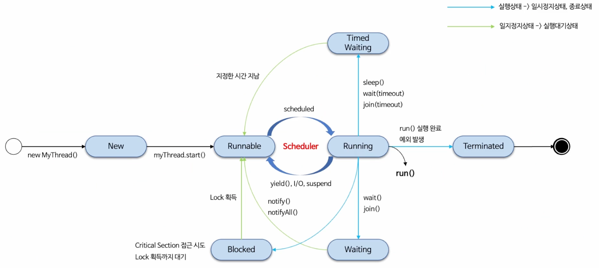

# java 스레드 생성 및 실행 구조

## java 스레드
JVM에서 User Thread를 생성할때 시스템 콜을 통해서 커널에서 생성된 Kernel Thread와 1:1로 매핑되어
최종적으로 커널에서 관리된다.
java에서는 Platform threads 라고 명시하고 있다.

java 스레드는 OS 스케줄러에 의해 실행 순서가 결정되며 스레드 실행 시점을 JVM에서 제어할 수 없다

## Thread 구조

## 1. 스레드 생성
- 스레드를 생성하는 방법은 크게 2가지가 있다.
  - Thread 클래스를 상속받아 run() 메소드를 오버라이딩하는 방법
  - Runnable 인터페이스를 구현하는 방법

## 2. 스레드 실행 및 종료
- 스레드를 실행하는 방법은 start() 메소드를 호출하는 것이다.
- 스레드를 종료하는 방법은 run() 메소드가 종료되면 된다.

### 스레드 실행
- start가 아닌 run 메서드 호출시 단순히 메서드 호출이 되어 스레드가 실행되지 않는다.
- 스레드는 한번 시작하면 다시 시작할 수 없다.
- 종료된 스레드는 다시 시작할 수 없다.

### 스레드 스택
- 스레드는 자신만의 스택을 가지고 있다.
- 스레드마다 독립적인 스택을 가지고 있기 때문에 스레드 간의 데이터 접근하거나 공유할 수 없다. -> 스레드로부터 안전한다.
- 스택은 OS에 따라 크기가 다르고, 주어진 크기를 넘어가면 StackOverflowError가 발생한다.

### 스택의 구성
- LIFO 순서로 이루어지며 프레임 단위로 구성된다.
- 프레임은 메서드 호출 시마다 생성되며 메서드가 종료되면 프레임도 사라진다.

### 스택 메모리 상태 관리
- 스택 내부의 변수는 메서드가 실행되는 동안에만 존재하며 메서드가 종료되면 사라진다.
- 스택 메모리에 대한 액세스는 Heap 메모리에 대한 액세스보다 빠르다.

### 스레드 종료
- 스레드는 run() 메소드가 종료되면 종료된다.
- 스레드는 예외가 발생할 경우 종료되며 다른 스레드에게 영향을 미치지 않는다. 
- 스레드가 종료되면 스레드 객체는 GC의 대상이 된다.
- 스레드가 종료되지 않고 계속 실행되는 경우가 있는데 이를 데몬 스레드라고 한다.
- 데몬 스레드는 다른 스레드가 모두 종료되면 자동으로 종료된다.
- 

## 3. 스레드 생명주기와 상태
- 스레드는 생성, 실행, 대기, 종료의 상태를 가진다.
- 스레드의 상태는 Thread.State 열거형으로 표현된다.
- 스레드의 상태는 getState() 메소드로 확인할 수 있다.
- 스레드의 상태는 스레드 스케줄러에 의해 결정된다.

### 스레드 생명주기
- java 스레드는 생성과 실행 그리고 종료에 따른 상태를 갖고 있으며 JVM에서는 생명주기가 있다.
- 생명주기별로 상태값을 갖는데 6가지이며 OS 스레드 상태와 일치하지 않는다.
- 어떤 시점에서든 6가지 상태중 오직 하나의 상태를 가질 수 있다.
- getState() 메소드로 현재 스레드의 상태를 확인할 수 있다.
- Thread.State 열거형으로 표현된다.
- New, Runnable, Blocked, Waiting, Timed_Waiting, Terminated
- New: 스레드가 생성되었지만 start() 메소드가 호출되지 않은 상태
- Runnable: 실행 가능한 상태로 스레드 스케줄러에 의해 실행될 수 있는 상태
  - start()를 호출하면 내부적으로 커널로의 실행이 일어나고 커널 스레드와 1:1 매핑된다.
  - 스레드는 바로 실행 상태가 아닌 언제든지 실행할 준비가 되어 있는 실행 가능한 상태가 된다.
  - 스레드가 실행상태로 전환하기 위해서는 현재 스레드가 어떤 상태로 존재하든지 반드시 실행대기 상태(Runnable)를 거쳐야 한다.
  - OS 스케줄러가 실행 가능한 상태의 스레드 중 하나를 선택해서 실행한다.
    - 실행 가능한 상태의 스레드에게 실행할 시간을 제공하는 것은 OS 스케줄러에 의해 결정된다.
    - 스케줄러는 멀티 스레드 환경에서 각 스레드에게 고정된 시간을 할당해서 실행 상태와 실행 가능한 상태를 오가도록 스케줄링한다.
    - 스케줄링 되면, cpu를 할당 받아 run() 메소드가 실행된다.
    - 아주 짧은 시간 동안 실행되고, 다른 스레드가 실행될 수 있도록 cpu를 일시 중지하고 다른 스레드에 양도한다.
    - 실행 상태에서 생성과 종료 상태를 제외한 다른 상태로 전환될때 스레드 혹은 프로세스간 컨텍스트 스위칭이 일어난다.
- Blocked: 스레드가 동기화 블록에 의해 대기하는 상태
- Waiting: 스레드가 다른 스레드가 통지할 때까지 대기하는 상태
- Timed_Waiting: 스레드가 특정 시간동안 대기하는 상태
- Terminated: 스레드가 종료된 상태

### 스레드 상태 전이
- Running -> Runnable
  - yield() 메소드를 호출하거나 OS 스케줄러에 의해 cpu 실행을 일시 중지하는 경우 실행 상태에서 실행 가능한 상태로 전환된다.

- Running -> Time_Waiting ( 지정된 시간이 있는 경우 )
  - sleep() 및 time-out 매개변수가 있는 메서드를 호출할 때 시간이 지정된 대기 상태가 된다.
    - sleep(time)
    - wait(timeout)
    - join(timeout)
  - 스레드의 대기시간이 길어지고 cpu 할당을 계속 받지 못하는 상황이 발생하면 기아 상태가 발생하게 되는데 이 상황을 피할 수 있다.

- Time_Waiting -> Runnable
  - 지정한 시간 지남
  - 인터럽트 발생
  - 통지 받음

- Running -> Blocked
  - Critical Section(임계 영역)에 진입하려는 스레드가 이미 다른 스레드에 의해 점유되어 있는 경우
    - 임계영역: 오직 하나의 스레드만 접근할 수 있도록 보호되어야 하는 영역
    - 스레드는 동기화된 임계영역에 진입하기 위해 lock을 획득하려고 시도하고 lock을 획득하지 못하면 스레드가 lock을 획득할 때까지 대기한다.

- Blocked -> Runnable
  - lock을 획득하면 실행 가능한 상태로 전환된다.
  
- Running -> Waiting ( 지정한 시간이 없이 대기 )
  - 스레드가 실행 상태에서 다른 스레드가 특정 작업을 수행하기를 기다리는 상태
  - wait()은 다른 스레드에 의해 notify() 받을때 까지, join()은 스레드의 실행이 종료되거나 인터럽트가 발생할때 까지 대기한다.
    - wait() 메서드는 스스로 빠져나오지 못한다. 
    - join() 메서드는 해당 스레드에서 다른 스레드로 실행상태를 넘기고, 다른 스레드가 종료되면 자신의 실행상태로 돌아오게 된다.

- Waiting -> Runnable
  - notify() 메소드 호출
  - notifyAll() 메소드 호출
  - 인터럽트 발생

- Runnable -> Terminated
  - run() 메소드가 종료되면 종료 상태가 된다.
  - 예외 발생 

### 참고 - Running 상태
- 스레드에는 없는 상태정보이나 전체 생명주기 흐름을 이해하기 위해 실행 중인 상태를 표시한 것이며, Runnable 상태에 포함된 개념이라고 볼수 있다.