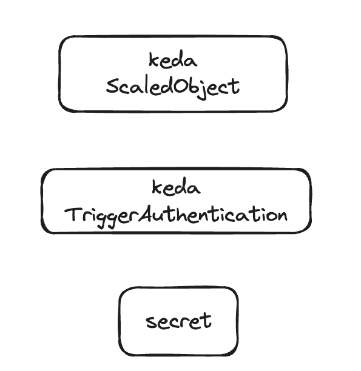
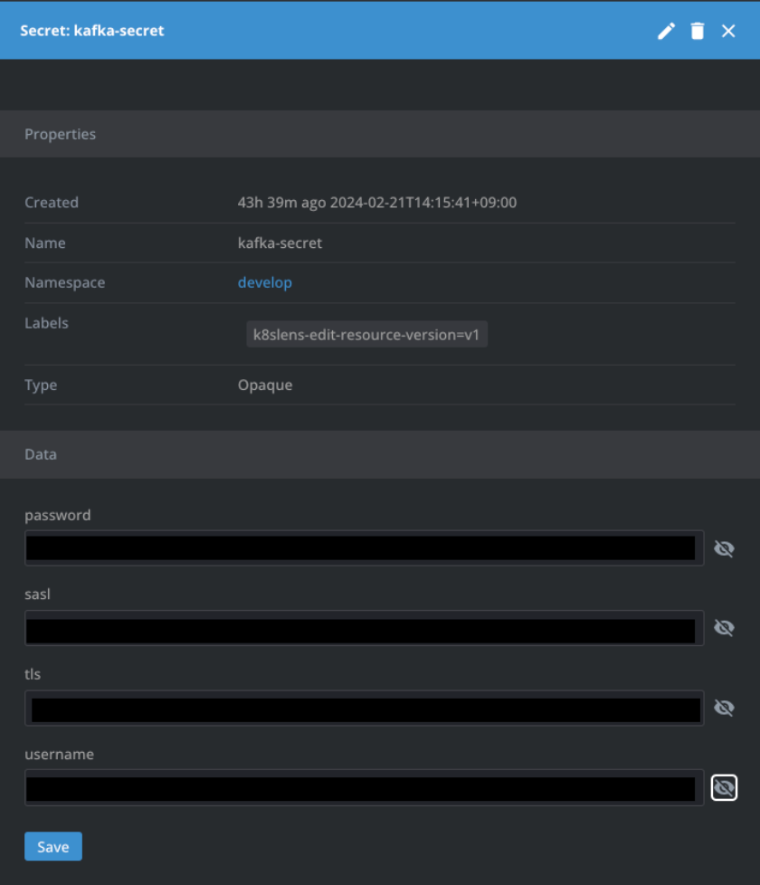

# kafka consumer lag으로 kafka consumer auto scaling하기

## 개요
- kafka consumer lag을 기반으로 kafka consumer를 auto scaling하는 방법을 알아본다.

## 준비사항
- kafka cluster
- k8s cluster
- keda
- lens 

## 상황
- kafka consumer가 lag이 쌓이면, kafka consumer를 늘려서 lag을 줄이고, lag이 줄면 kafka consumer를 줄여서 자원을 절약하고 싶다.

## 해결방안
- keda를 이용하여 kafka consumer lag을 기반으로 kafka consumer를 auto scaling한다.

## 구성요소


## 구현
### 1. ScaledObject 생성
- HPA가 적용될 Deployment를 지정합니다.
  - metadata.labels.deploymentName: HPA가 적용될 Deployment의 이름
  - spec.scaleTargetRef.name: HPA가 적용될 Deployment의 이름
- pollInterval: kafka consumer lag을 체크하는 주기
- minReplicaCount: 최소 kafka consumer 수
- maxReplicaCount: 최대 kafka consumer 수
- consumerGroup을 지정합니다.
  - spec.triggers.metadata.consumerGroup: kafka consumer group 이름
  - spec.triggers.metadata.bootstrapServers: kafka broker host:port
  - spec.triggers.metadata.topic: kafka topic 이름
- lagThreshold: lag이 이 값 이상이면 kafka consumer를 늘립니다.
- authenticationRef는 triggerAuthenticationName을 지정합니다.

```yaml
apiVersion: keda.sh/v1alpha1  
kind: ScaledObject  
metadata:  
  name: kafka-scaledobject  
  namespace: develop  
  labels:  
    deploymentName: deploymentName  
spec:  
  scaleTargetRef:  
    name: deploymentName  
  pollingInterval: 5  
  minReplicaCount: 1  
  maxReplicaCount: 2  # Max can go upto num of partitions you have in the topic  
  triggers:  
    - type: kafka  
      metadata:  
        consumerGroup: consumer-group-name  
        bootstrapServers: brokerhost:port   
        topic: topic-name
        lagThreshold: "2"  
        activationLagThreshold: "1"  
        offsetRestPolicy: latest  
      authenticationRef:  
        name: develop-keda-kafka-credentials
```
### 2. TriggerAuthentication 생성
- kafka broker에 접근하기 위한 인증 정보를 지정합니다.
- secret을 추가해줍니다.
  - sasl: "plaintext"
  - tls: "enable"
  - 


```yaml
apiVersion: keda.sh/v1alpha1  
kind: TriggerAuthentication  
metadata:  
  name: keda-kafka-credentials  
  namespace: develop  
spec:  
  secretTargetRef:  
    - parameter: username  
      name: kafka-secret
      key: username  
    - parameter: password  
      name: kafka-secret  
      key: password  
    - parameter: sasl  
      name: kafka-secret  
      key: sasl  
    - parameter: tls  
      name: kafka-secret  
      key: tls
```

## 운영 및 관리
- 해당 컨슈머에서 처리하는 job이 초를 다툴정도로 빠르게 처리되야하는 경우는 아니였고, scale-out이 빠르게 동작하며 consumer lag를 제거하는 것을 확인했습니다.
- consumer lag보다 낮아지면서 cooldown period가 지나면 scale-in도 잘 동작합니다. 

## 참고자료
- keda: https://devocean.sk.com/blog/techBoardDetail.do?ID=164800
- trigger specification: https://keda.sh/docs/2.13/scalers/apache-kafka/#trigger-specification
- cooldown period: https://keda.sh/docs/2.13/concepts/scaling-deployments/#cooldownperiod
